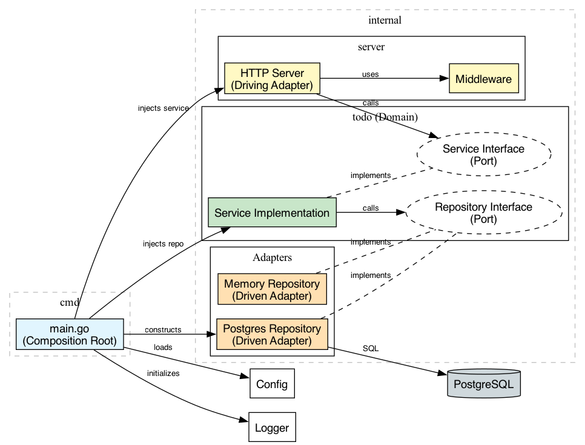

# Overview

This repository is an attempt to combine pragmatic design patterns for developing http servers in Go into an example that can be easily adapted in other projects.

# Architecture & Design

This project follows **Hexagonal Architecture** (also known as Ports and Adapters). The goal is to decouple the core business logic from external concerns like the database, the HTTP transport layer, or configuration.

## Core Components

1.  **Domain (`internal/todo`)**: This is the heart of the application. It defines the `Todo` entity and the interfaces (`Service` and `Repository`) that the rest of the application uses. It has no dependencies on the database or HTTP server.
2.  **Service (`internal/todo/service.go`)**: Implements the business logic. It relies on the `Repository` interface to persist data, but doesn't know *how* that data is persisted.
3.  **Server (`internal/server`)**: The HTTP "Driving Adapter". It handles incoming HTTP requests, parses JSON, validates input, and calls the `Service`. It doesn't know about SQL or database connections.
4.  **Storage (`internal/todo/postgres`, `internal/todo/memory`)**: The "Driven Adapters". These implement the `Repository` interface defined in the domain.
5.  **Composition Root (`cmd/main.go`)**: This is where everything is wired together. It reads config, initializes the database connection, creates the repository, injects it into the service, and injects the service into the HTTP server.

## Design Patterns Used

*   **Dependency Injection**: Dependencies are explicitly passed to constructors (e.g., `NewServer(service)`, `NewService(repo)`). This makes testing easier by allowing mocks to be swapped in.
*   **Graceful Shutdown**: The server listens for OS interrupt signals and ensures that active requests are completed before shutting down.
*   **Structured Logging**: Uses Go's `log/slog` for structured, context-aware logging. Request IDs are generated in middleware and threaded through the context.
*   **Configuration**: 12-factor app style configuration using environment variables.

# Usage

## Prerequisites

*   Go 1.24+
*   Docker (for PostgreSQL)
*   Make

## Running the Server

1.  **Setup Configuration**:
    ```shell
    cp .env_example .env
    ```

2.  **Start the Database**:
    ```shell
    make build-db
    ```

3.  **Run the Application**:
    ```shell
    make run
    ```
    The server will start on `http://localhost:8080`.

4.  **Run Tests**:
    ```shell
    make test
    ```

## Visualizing the Architecture



---

# Acknowledgements

I'm heavily indebted to [Mat Ryer](https://github.com/matryer) for the ideas and patterns in this repository. He was a host of [Go Time](https://changelog.com/gotime), has written copiously, and has given a number of talks. That said, I am not proceeding religiously with his suggestions, and there may be aspects of the template that he would agree with. I would love to know what you think about particular decisions, and I'd love to talk about alternatives. As he mentions in this [episode of Go Time](https://www.youtube.com/watch?v=tJ1zvBBkmmY&ab_channel=Changelog), his blog posts and talks are meant to be places to draw ideas from, not things to be followed to the letter. The patterns should only be used if they work for you.

- [How I write HTTP services in Go after 13 years - Grafana Blog](https://grafana.com/blog/2024/02/09/how-i-write-http-services-in-go-after-13-years/)
- [How Mat writes HTTP services in Go - Changelog: Go Time](https://www.youtube.com/watch?v=tJ1zvBBkmmY&ab_channel=Changelog)
- [GopherCon 2019: How I Write HTTP Web Services after Eight Years - Mat Ryer](https://www.youtube.com/watch?v=rWBSMsLG8po&ab_channel=GopherAcademy)
- [How I build APIs capable of gigantic scale in Go – Mat Ryer](https://www.youtube.com/watch?v=FkPqqakDeRY)
